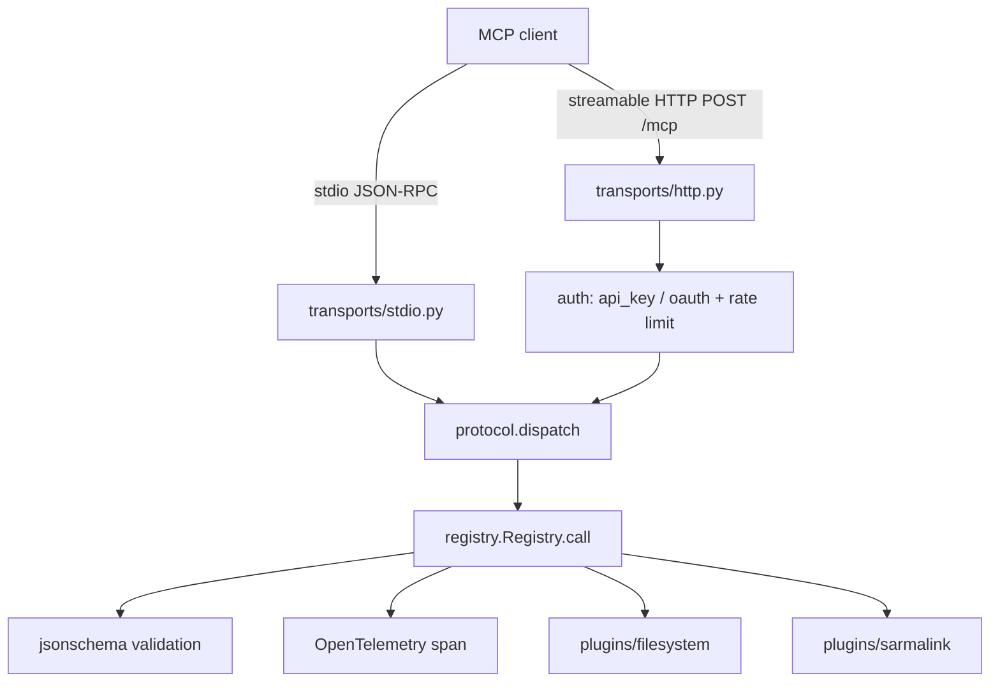

# Architecture

mcp-server-toolkit is a thin, opinionated layer over the Model Context Protocol. The design goal is that a tool author writes one async function and gets schema validation, auth, rate limiting, tracing, and two transports for free.



## Components

| Module | Responsibility |
|---|---|
| `server.py` | Lifecycle: select transport, set up telemetry, import plugins |
| `protocol.py` | MCP 1.0 JSON-RPC dispatch shared by both transports |
| `registry.py` | Decorator-based tool registry: schema generation, validation, span wrapping |
| `transports/stdio.py` | JSON-RPC 2.0 loop over stdin/stdout, one message per line |
| `transports/http.py` | FastAPI app: `POST /mcp`, REST `/tools`, `/health`, auth, rate limiting |
| `auth/api_key.py` | Constant-time API key comparison |
| `auth/oauth.py` | OAuth 2.1 resource server: JWT validation against issuer JWKS |
| `auth/ratelimit.py` | Per-client token bucket |
| `oauth_client.py` | OAuth 2.1 PKCE client flow for obtaining tokens |
| `telemetry.py` | OpenTelemetry tracer provider and structlog configuration |
| `config.py` | Settings from environment, `MCP_` prefix |
| `cli.py` | `run`, `doctor`, `init`, `login` commands |

## Protocol layer

Both transports parse a JSON-RPC message and hand it to `protocol.dispatch`, which is the single source of truth for MCP behaviour. It handles:

- `initialize`: negotiates the protocol version (newest supported wins if the client asks for something unknown) and returns `serverInfo` and `capabilities`.
- `notifications/initialized`: acknowledged with no response, as notifications must be.
- `ping`: returns an empty result.
- `tools/list`: returns the registry's advertised tools, including `outputSchema` where declared.
- `tools/call`: validates arguments, runs the handler, and returns content blocks. A string becomes a text block; a dict is JSON-encoded and also returned as `structuredContent`. Validation errors map to JSON-RPC `-32602`; unknown tools to `-32601`; handler exceptions to a tool result with `isError: true`.

Keeping this in one place is why a tool behaves identically over stdio and HTTP.

## Tool registration flow

```python
@registry.tool("search_docs", description="Search internal docs")
async def search_docs(query: str, limit: int = 10) -> dict:
    return {"results": [...]}
```

The decorator inspects type hints with `typing.get_type_hints`, maps each parameter to a JSON Schema fragment (`str` to `string`, `int` to `integer`, `list[str]` to an array of strings, `X | None` to the inner type, and so on), and marks parameters without a default as required. The schema sets `additionalProperties: false`, so unexpected arguments are rejected. Handlers must be `async`; the decorator raises at registration time otherwise.

## Validation and tracing

`Registry.call` validates arguments against the input schema, opens an OpenTelemetry span named `tool.<name>`, runs the handler, records duration and any error on the span, and finally validates the return value against the `output_schema` when one is declared. The span exports through the OTLP exporter when `MCP_OTEL_ENDPOINT` is set; otherwise tracing is a no-op and structured logs still flow to stderr.

## Transport selection

stdio: the client launches the server as a subprocess and exchanges JSON-RPC over stdin/stdout. Logs are written to stderr so stdout stays a clean message channel, which the MCP specification requires.

Streamable HTTP: clients POST JSON-RPC to `/mcp`. Auth and rate limiting run as a FastAPI dependency on the protected routes; `/health` is always open for readiness probes. A small REST surface (`GET /tools`, `POST /tools/{name}`) is provided for quick inspection.

Same registry, same plugins, same handlers. The transport is a shell around `protocol.dispatch`.
