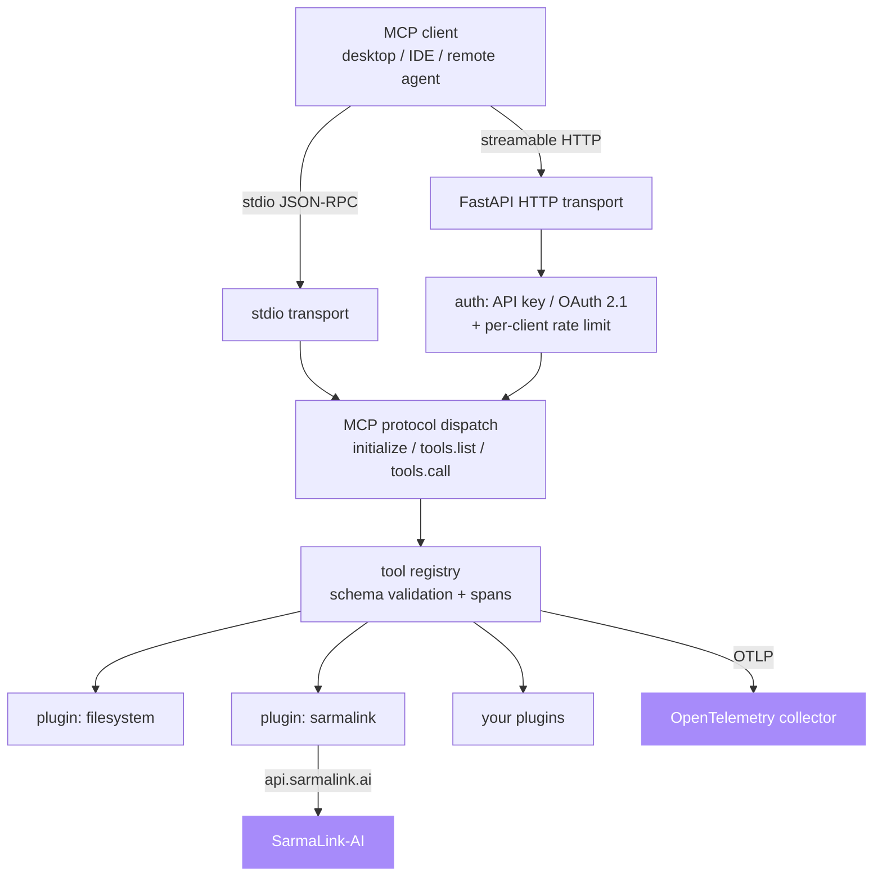

# mcp-server-toolkit

**The batteries-included starter for production Model Context Protocol servers.**

[](https://github.com/sarmakska/mcp-server-toolkit/actions/workflows/ci.yml)
[](https://opensource.org/licenses/MIT)
[](https://github.com/sarmakska/mcp-server-toolkit)
[](https://github.com/sarmakska/mcp-server-toolkit/commits/main)
[](https://python.org)
[](https://modelcontextprotocol.io)

MCP became the default integration layer for agents, and most reference servers are still toys: a single tool, no auth, no observability. This toolkit is the opinionated alternative that ships an MCP 1.0 compliant server with the plumbing already wired in. Write a tool once and reach it over stdio for a local agent and over streamable HTTP for a remote one, with the same handler, schema validation, auth, rate limiting, and tracing on every call.

Built by [Sarma Linux](https://sarmalinux.com).

---

## Architecture



## Quick start

```bash
git clone https://github.com/sarmakska/mcp-server-toolkit.git
cd mcp-server-toolkit
uv sync
cp .env.example .env
uv run mcp-toolkit run --transport stdio
```

That boots an MCP server over stdio with the bundled plugins registered. Point a desktop client or IDE at it (see the [Quick-Start wiki page](https://github.com/sarmakska/mcp-server-toolkit/wiki/Quick-Start)), or drive it by hand:

```bash
printf '%s\n' \
  '{"jsonrpc":"2.0","id":1,"method":"initialize","params":{"protocolVersion":"2025-06-18"}}' \
  '{"jsonrpc":"2.0","id":2,"method":"tools/list"}' \
  | uv run mcp-toolkit run --transport stdio
```

For remote use, switch to HTTP and call the MCP endpoint:

```bash
uv run mcp-toolkit run --transport http --port 8000
curl -s localhost:8000/mcp -d '{"jsonrpc":"2.0","id":1,"method":"tools/list"}'
```

## What is in the box

- **MCP 1.0 compliant.** Full `initialize` handshake with protocol version negotiation (`2025-06-18`, `2025-03-26`, `2024-11-05`), `notifications/initialized`, `ping`, `tools/list`, and `tools/call` with content blocks and structured results. The protocol layer is shared, so both transports behave identically.
- **Two transports, one code path.** stdio (JSON-RPC 2.0) for local agents, streamable HTTP (FastAPI) at `POST /mcp` for remote deployment. A tool written once is reachable over both.
- **Auth built in.** API key (constant-time comparison) or OAuth 2.1 bearer tokens validated against the issuer's JWKS with issuer and audience checks, selected by `MCP_AUTH`. A `mcp-toolkit login` command runs the OAuth 2.1 PKCE flow to obtain a token against a hosted server.
- **Schema validation.** The registry derives a JSON Schema from each handler's type hints and validates every call's arguments against it. Declare an `output_schema` and the return value is validated too, then surfaced as MCP `structuredContent`.
- **Per-client rate limiting.** Token bucket keyed by client identity, configurable with `MCP_RATE_LIMIT_RPS`.
- **Span export.** Every tool call runs inside an OpenTelemetry span with name, argument count, duration, and error type. Set an OTLP endpoint and spans export; otherwise structured JSON logs still flow to stderr.
- **Two example plugins.** A sandboxed `filesystem` plugin and a `sarmalink` plugin that wraps an external API end to end.
- **Container image.** Reproducible uv-based multi-stage build that runs as a non-root user with a health check.

## Plugin authoring

A plugin is a Python module that registers handlers with `@registry.tool`. The input schema comes from the type hints.

```python
from mcp_toolkit.registry import registry

@registry.tool("search_docs", description="Search internal docs")
async def search_docs(query: str, limit: int = 10) -> dict:
    return {"results": [...]}
```

`query` is required (no default) and typed as a string; `limit` is optional and typed as an integer. The generated schema reflects both. See [Plugin-Authoring](https://github.com/sarmakska/mcp-server-toolkit/wiki/Plugin-Authoring).

## Configuration

| Env var | Purpose | Default |
|---|---|---|
| `MCP_TRANSPORT` | `stdio` or `http` | `stdio` |
| `MCP_HTTP_HOST` / `MCP_HTTP_PORT` | HTTP bind address | `0.0.0.0:8000` |
| `MCP_AUTH` | `none`, `api_key`, `oauth` | `none` |
| `MCP_API_KEY` | key for `api_key` mode | unset |
| `MCP_OAUTH_ISSUER` / `MCP_OAUTH_AUDIENCE` | OAuth resource server checks | unset |
| `MCP_OAUTH_JWKS_URI` | explicit JWKS endpoint (else discovered) | unset |
| `MCP_RATE_LIMIT_RPS` / `MCP_RATE_LIMIT_BURST` | per-client rate limit | `0` (off) |
| `MCP_FS_ROOT` | filesystem plugin sandbox root | `~/mcp-data` |
| `MCP_OTEL_ENDPOINT` | OTLP collector URL for span export | unset |
| `MCP_SARMALINK_API_KEY` | key for the sarmalink plugin | unset |

All settings use the `MCP_` prefix and can be supplied via a `.env` file. See [.env.example](.env.example).

## Deployment

```bash
docker build -t mcp-toolkit .
docker run -p 8000:8000 --env-file .env mcp-toolkit
```

The image runs the HTTP transport as a non-root user with a built-in health check. Front it with TLS termination (your platform's load balancer, or Caddy on a VPS). See [Deployment](https://github.com/sarmakska/mcp-server-toolkit/wiki/Deployment).

## When to use this, when not to

Use this when you are building an MCP server that needs to ship: you want auth, schema validation, tracing, rate limiting, and both transports without writing the plumbing, and you want the same plugin code to run locally over stdio and in production over HTTP. It suits internal tool gateways, remote MCP servers for a team, and bridges that wrap an existing API as MCP tools.

Do not reach for this if you only need a throwaway single-tool stdio server for one local agent, where the reference SDK example is lighter. It is also not a managed product: you host and operate it yourself.

## Documentation

Full docs live in the [wiki](https://github.com/sarmakska/mcp-server-toolkit/wiki): architecture, quick start, plugin authoring, auth modes, observability, and deployment. The bundled [sarmalink plugin](src/mcp_toolkit/plugins/sarmalink/handlers.py) is a working end-to-end example of a tool that calls an external API. See also [ARCHITECTURE.md](ARCHITECTURE.md), [ROADMAP.md](ROADMAP.md), and [CHANGELOG.md](CHANGELOG.md).

## License

MIT. Built by [Sarma Linux](https://sarmalinux.com).

---

## More open source by Sarma

Part of a portfolio of twelve production-shaped open-source repositories built and maintained by [Sarma](https://sarmalinux.com).

| Repository | What it is |
|---|---|
| [Sarmalink-ai](https://github.com/sarmakska/Sarmalink-ai) | Multi-provider OpenAI-compatible AI gateway with 14-engine failover and intent-based plugin auto-routing |
| [agent-orchestrator](https://github.com/sarmakska/agent-orchestrator) | Durable multi-agent workflows in TypeScript with deterministic replay and Inspector UI |
| [voice-agent-starter](https://github.com/sarmakska/voice-agent-starter) | Sub-second full-duplex voice agent loop. WebRTC, mediasoup, pluggable STT / LLM / TTS |
| [ai-eval-runner](https://github.com/sarmakska/ai-eval-runner) | Evals as code. Python, DuckDB, FastAPI viewer, regression mode for CI |
| [mcp-server-toolkit](https://github.com/sarmakska/mcp-server-toolkit) | Production Model Context Protocol server starter (Python / FastAPI) |
| [local-llm-router](https://github.com/sarmakska/local-llm-router) | OpenAI-compatible proxy that routes to Ollama or cloud providers based on policy |
| [rag-over-pdf](https://github.com/sarmakska/rag-over-pdf) | Minimal end-to-end RAG starter for PDF corpora |
| [receipt-scanner](https://github.com/sarmakska/receipt-scanner) | Vision OCR for receipts with Zod-validated JSON output |
| [webhook-to-email](https://github.com/sarmakska/webhook-to-email) | Webhook receiver that forwards events to email via Resend |
| [k8s-ops-toolkit](https://github.com/sarmakska/k8s-ops-toolkit) | Helm chart for shipping Next.js to Kubernetes with full observability stack |
| [terraform-stack](https://github.com/sarmakska/terraform-stack) | Vercel + Supabase + Cloudflare + DigitalOcean modules in one Terraform repo |
| [staff-portal](https://github.com/sarmakska/staff-portal) | Open-source HR / ops portal: leave, attendance, expenses, kiosk mode |

Engineering essays at [sarmalinux.com/blog](https://sarmalinux.com/blog) &middot; All projects at [sarmalinux.com/open-source](https://sarmalinux.com/open-source)
