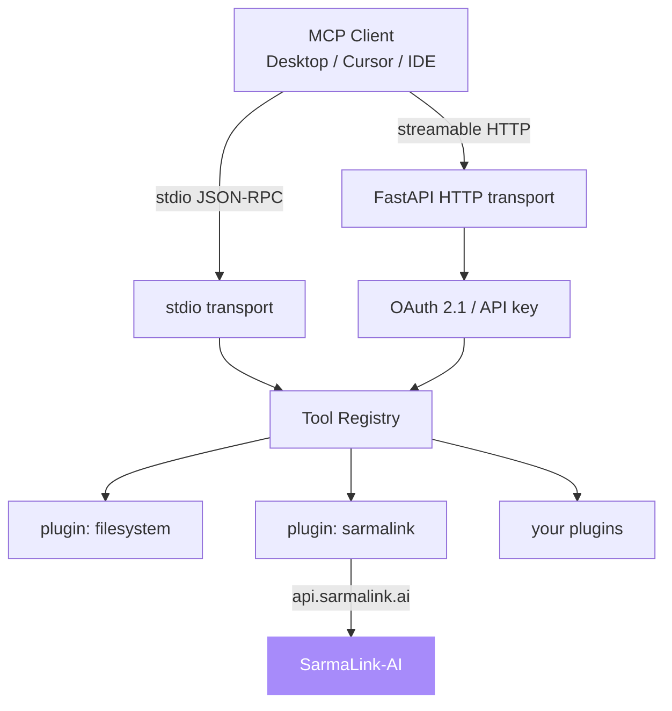

# mcp-server-toolkit

**Production-ready Model Context Protocol server starter with auth, tracing, and a plugin system.**

[](https://github.com/sarmakska/mcp-server-toolkit/actions/workflows/ci.yml)
[](https://opensource.org/licenses/MIT)
[](https://github.com/sarmakska/mcp-server-toolkit)
[](https://github.com/sarmakska/mcp-server-toolkit/commits/main)
[](https://python.org)
[](https://modelcontextprotocol.io)

Built by [Sarma Linux](https://sarmalinux.com).

---

## What this is

MCP went from niche spec to default integration layer in late 2025. Every serious agent now speaks it. Most reference servers are toys: a single tool, no auth, no observability. This toolkit is the opinionated batteries-included alternative.

Scaffold an MCP server in one command. Drop tool handlers into a plugins directory. Get OAuth 2.1 with PKCE, structured logging, OpenTelemetry traces, rate limiting, and a typed tool registry for free. Runs over stdio for local agents and streamable HTTP for remote ones, same code path.

## Architecture



## What is in the box

- **Two transports, one code path.** stdio (JSON-RPC 2.0) for local agents, streamable HTTP (FastAPI) for remote deployment. A tool written once is reachable over both.
- **Auth built in.** OAuth 2.1 with PKCE or API key, selected by environment variable.
- **Plugin system.** One directory, one `@registry.tool` decorator, auto-imported on start. Handler signatures generate the tool JSON schema.
- **Observability.** Structured JSON logs via structlog by default; set an OTLP endpoint and every tool call is exported as an OpenTelemetry span.
- **Rate limiting** per client, configurable.
- **Distroless Docker image** (~120MB) that runs on Fly.io, Render, Railway, and Kubernetes.
- **Two example plugins.** A local `filesystem` plugin and a `sarmalink` plugin that wraps an external API end to end.

## Quick start

```bash
git clone https://github.com/sarmakska/mcp-server-toolkit.git
cd mcp-server-toolkit
uv sync
cp .env.example .env
uv run mcp-toolkit run --transport stdio
```

## Plugin authoring

```python
from mcp_toolkit.registry import registry

@registry.tool("search_docs", description="Search internal docs")
async def search_docs(query: str) -> dict:
    return {"results": [...]}
```

## Configuration

| Env var | Purpose | Default |
|---|---|---|
| `MCP_TRANSPORT` | `stdio` or `http` | `stdio` |
| `MCP_AUTH` | `none`, `api_key`, `oauth` | `none` |
| `MCP_HTTP_PORT` | port for the HTTP transport | `8000` |
| `MCP_OTEL_ENDPOINT` | OTLP collector URL | unset |
| `MCP_SARMALINK_API_KEY` | key for the sarmalink plugin | unset |

All settings use the `MCP_` prefix and can also be supplied via a `.env` file. See [.env.example](.env.example).

## Deployment

Distroless Docker image, ~120MB. Runs on Fly.io, Render, Railway, k8s.

```bash
docker build -t mcp-toolkit .
docker run -p 8000:8000 --env-file .env mcp-toolkit
```

## When to use this, when not to

Use this when you are building an MCP server that needs to ship: you want auth, tracing, rate limiting, and both transports without writing the plumbing, and you want the same plugin code to run locally over stdio and in production over HTTP. It suits internal tool gateways, remote MCP servers for a team, and bridges that wrap an existing API as MCP tools.

Do not reach for this if you only need a throwaway single-tool stdio server for one local agent, where the reference SDK example is lighter. It is also not a managed product: you host and operate it yourself. If your tools are pure read-only file access with no auth requirement, the overhead here is more than you need.

## Documentation

Full docs live in the [wiki](https://github.com/sarmakska/mcp-server-toolkit/wiki): architecture, quick start, plugin authoring, auth modes, observability, and deployment. The bundled [sarmalink plugin](src/mcp_toolkit/plugins/sarmalink/handlers.py) is a working end-to-end example of a side-effecting tool that calls an external API.

## Roadmap

See the [Roadmap](https://github.com/sarmakska/mcp-server-toolkit/wiki/Roadmap) and open [issues](https://github.com/sarmakska/mcp-server-toolkit/issues). PRs welcome.

## License

MIT.

Built by [Sarma Linux](https://sarmalinux.com).


---

## More open source by Sarma

Part of a portfolio of twelve production-shaped open-source repositories built and maintained by [Sarma](https://sarmalinux.com).

| Repository | What it is |
|---|---|
| [Sarmalink-ai](https://github.com/sarmakska/Sarmalink-ai) | Multi-provider OpenAI-compatible AI gateway with 14-engine failover and intent-based plugin auto-routing |
| [agent-orchestrator](https://github.com/sarmakska/agent-orchestrator) | Durable multi-agent workflows in TypeScript with deterministic replay and Inspector UI |
| [voice-agent-starter](https://github.com/sarmakska/voice-agent-starter) | Sub-second full-duplex voice agent loop. WebRTC, mediasoup, pluggable STT / LLM / TTS |
| [ai-eval-runner](https://github.com/sarmakska/ai-eval-runner) | Evals as code. Python, DuckDB, FastAPI viewer, regression mode for CI |
| [mcp-server-toolkit](https://github.com/sarmakska/mcp-server-toolkit) | Production Model Context Protocol server starter (Python / FastAPI) |
| [local-llm-router](https://github.com/sarmakska/local-llm-router) | OpenAI-compatible proxy that routes to Ollama or cloud providers based on policy |
| [rag-over-pdf](https://github.com/sarmakska/rag-over-pdf) | Minimal end-to-end RAG starter for PDF corpora |
| [receipt-scanner](https://github.com/sarmakska/receipt-scanner) | Vision OCR for receipts with Zod-validated JSON output |
| [webhook-to-email](https://github.com/sarmakska/webhook-to-email) | Webhook receiver that forwards events to email via Resend |
| [k8s-ops-toolkit](https://github.com/sarmakska/k8s-ops-toolkit) | Helm chart for shipping Next.js to Kubernetes with full observability stack |
| [terraform-stack](https://github.com/sarmakska/terraform-stack) | Vercel + Supabase + Cloudflare + DigitalOcean modules in one Terraform repo |
| [staff-portal](https://github.com/sarmakska/staff-portal) | Open-source HR / ops portal — leave, attendance, expenses, kiosk mode |

Engineering essays at [sarmalinux.com/blog](https://sarmalinux.com/blog) &middot; All projects at [sarmalinux.com/open-source](https://sarmalinux.com/open-source)
