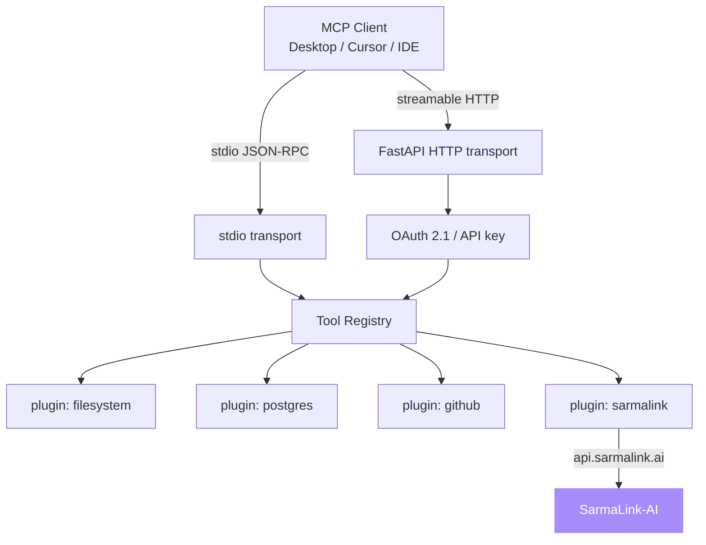

# mcp-server-toolkit

[](https://opensource.org/licenses/MIT)
[](https://python.org)
[](https://fastapi.tiangolo.com)
[](https://modelcontextprotocol.io)
[](https://opentelemetry.io)
[](https://docker.com)
[](https://github.com/sarmakska/mcp-server-toolkit)

**Production-ready Model Context Protocol server starter with auth, tracing, and a plugin system.**

Built by [Sarma Linux](https://sarmalinux.com).

---

## What this is

MCP went from niche spec to default integration layer in late 2025. Every serious agent now speaks it. Most reference servers are toys: a single tool, no auth, no observability. This toolkit is the opinionated batteries-included alternative.

Scaffold an MCP server in one command. Drop tool handlers into a plugins directory. Get OAuth 2.1 with PKCE, structured logging, OpenTelemetry traces, rate limiting, and a typed tool registry for free. Runs over stdio for local agents and streamable HTTP for remote ones, same code path.

## Architecture



## Quick start

```bash
git clone https://github.com/sarmakska/mcp-server-toolkit.git
cd mcp-server-toolkit
uv sync
cp .env.example .env
uv run mcp-toolkit run --transport stdio
```

## Plugin authoring

```python
from mcp_toolkit.registry import registry

@registry.tool("search_docs", description="Search internal docs")
async def search_docs(query: str) -> dict:
    return {"results": [...]}
```

## Configuration

| Env var | Purpose | Default |
|---|---|---|
| `MCP_TRANSPORT` | `stdio` or `http` | `stdio` |
| `MCP_AUTH` | `none`, `api_key`, `oauth` | `none` |
| `OTEL_EXPORTER_OTLP_ENDPOINT` | OTel collector URL | unset |
| `SARMALINK_API_KEY` | for the sarmalink plugin | unset |

## Deployment

Distroless Docker image, ~120MB. Runs on Fly.io, Render, Railway, k8s.

```bash
docker build -t mcp-toolkit .
docker run -p 8000:8000 --env-file .env mcp-toolkit
```

## Roadmap

See [docs/OPEN-ISSUES.md](docs/OPEN-ISSUES.md). PRs welcome.

## License

MIT.

Built by [Sarma Linux](https://sarmalinux.com).
